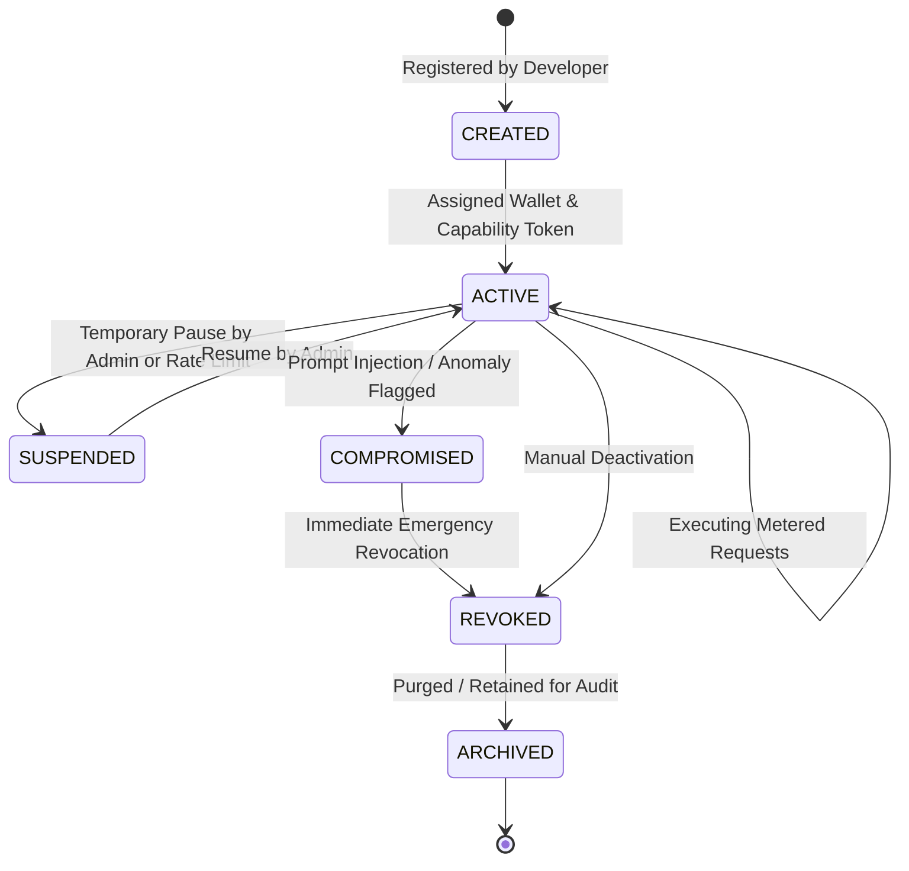

# Vaultbreaker 2.0 Agent Model & Lifecycle

## 1. Overview: How an Agent Exists in Vaultbreaker

In Vaultbreaker, an **Agent** is an autonomous software actor (LLM loop, autonomous agent framework, background script, or multi-agent node) that consumes metered resources and triggers on-chain payments.

Vaultbreaker enforces a fundamental security postulate: **AN AGENT MUST NEVER HOLD RAW PRIVATE KEYS OR UNCONSTRAINED CREDENTIALS.** Instead, agents exist as managed domain entities bound to hardware-protected wallets and restricted by scoped capabilities.

---

## 2. Canonical Agent Lifecycle



### 1. `CREATED`
The agent entity is registered by an administrator or developer in an Organization. Metadata, owner, and default policy templates are defined, but no capability tokens are issued yet.

### 2. `ACTIVE`
The agent is assigned a dedicated or shared Wallet reference and issued one or more active Capability Tokens. The agent can submit metered calls to protected endpoints within policy constraints.

### 3. `SUSPENDED`
An administrator temporarily pauses the agent's authority (e.g. for maintenance or cost review). Existing capability tokens return HTTP 403 `AGENT_SUSPENDED`.

### 4. `COMPROMISED`
Triggered automatically when an anomaly is detected (e.g., prompt injection attack, sudden 10x spend velocity surge, invalid signature flood). The broker immediately invalidates all active capabilities bound to this agent and notifies administrators.

### 5. `REVOKED`
Permanent termination of the agent's authority. On-chain revocation flags are published to `CapabilityRegistry.sol` for all associated capabilities, and `CAPABILITY_REVOKED` audit logs are written to Hedera HCS.

### 6. `ARCHIVED`
The agent record is retired. Historic audit logs and transaction receipts remain immutably queryable on Hedera HCS for compliance and record-keeping.

---

## 3. Agent Schema & Wallet Relationship

```typescript
export interface AgentEntity {
  agentId: string;
  orgId: string;
  ownerId: string;             // User ID of developer who registered agent
  name: string;
  description?: string;
  status: "CREATED" | "ACTIVE" | "SUSPENDED" | "COMPROMISED" | "REVOKED" | "ARCHIVED";
  
  // Wallet Binding
  wallet: {
    walletId: string;
    address: string;
    networkId: number;         // e.g. 296 (Hedera Testnet)
    keyringMode: "LEDGER_CLI" | "SEED_ENCLAVE";
  };
  
  // Aggregated Spend Metrics
  spending: {
    totalSpentHbar: number;
    totalCallsExecuted: number;
    totalCallsRejected: number;
    lastActiveTimestamp: string;
  };
  
  createdAt: string;
  updatedAt: string;
}
```

---

## 4. Capability Assignment & Emergency Isolation

1. **Assignment**: Capabilities are issued to specific `agentId` instances. An agent may hold multiple capabilities for different services (e.g., Cap A for Summarizer API, Cap B for Compute API).
2. **Isolation**: Compromise of Agent X's capability token has **zero impact** on Agent Y, as capabilities are bound to specific `capId` nonces and service addresses.
3. **Emergency Panic Button**: Invoking `broker.revokeAllAgentCapabilities(agentId)` instantly flags the agent as `REVOKED`, invalidates all active JWT tokens in memory, and submits revocation calls on-chain.
