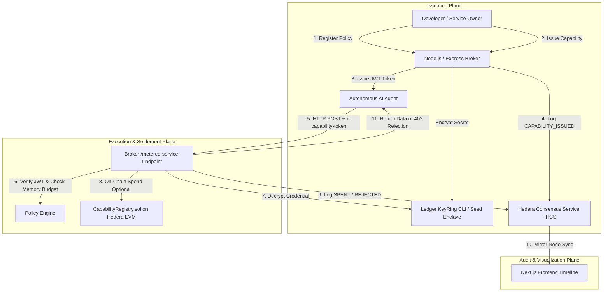

# Vaultbreaker Architecture Audit

## 1. High-Level Architecture Overview

Vaultbreaker implements a capability-based security model for autonomous AI agent micropayments. Instead of giving AI agents raw private keys or static API keys, Vaultbreaker introduces a **Broker Plane** that protects settlement credentials inside a Ledger key ring enclave, issuing short-lived, spend-limited JWT capability tokens to agents.



---

## 2. Component Responsibilities

### A. Frontend (`app/`)
- Provides UI for Policy Registration, Capability Minting, Token Revocation, and Agent Micropayment Simulation.
- Contains a built-in **In-Memory Fallback Store** (`app/src/lib/api.ts`) that mocks broker responses when the Node backend is offline (e.g. static Vercel deployment).

### B. Capability Broker (`broker/`)
- **Ledger KeyRing** (`broker/src/ledger/keyring.ts`): Wraps `wallet-cli ring` to encrypt/decrypt private keys via hardware. Falls back to AES-256-GCM seed encryption when CLI is unavailable.
- **Policy Engine** (`broker/src/policy/engine.ts`): Maintains policy definitions and issued capability states in-memory (`Map<string, IssuedCapability>`). Signs JWT tokens using a symmetric HMAC key (`JWT_SECRET`).
- **Hedera HCS Logger** (`broker/src/hedera/hcs.ts`): Submits structured audit log messages to a Hedera HCS topic using `@hashgraph/sdk`. Falls back to an in-memory array when operator credentials are default.
- **Express Router** (`broker/src/api/routes.ts`): Exposes REST endpoints for policy management, capability minting, metered calls, and audit retrieval. Optional JSON-RPC connection to `CapabilityRegistry.sol` using Ethers.js.

### C. Smart Contracts (`contracts/`)
- `CapabilityRegistry.sol`: Tracks `policyHash`, `service`, `budgetRemaining`, `expiry`, `issuer`, and `revoked` state on-chain. Contains `spend()`, `revoke()`, and `issueCapability()` methods.
- `X402FacilitatorAdapter.sol`: Serves as an authorized gateway that validates service binding before calling `registry.spend()`.

---

## 3. Data Flow & Request Lifecycles

### Request Lifecycle (`/api/metered-service`)
1. Agent sends HTTP `POST` to `/api/metered-service` with header `x-capability-token: <JWT>` and `x-payment-amount: <N>`.
2. Broker verifies JWT signature using `JWT_SECRET`.
3. Broker retrieves capability from internal `Map<string, IssuedCapability>` by `capId`.
4. Broker checks:
   - Is capability revoked? (`cap.revoked == true` -> Returns HTTP 403 `CAPABILITY_REVOKED`).
   - Is capability expired? (`now >= cap.expiry` -> Returns HTTP 402 `CAPABILITY_EXPIRED`).
   - Is remaining budget sufficient? (`cap.budgetRemaining < amount` -> Returns HTTP 402 `INSUFFICIENT_BUDGET`).
5. If checks pass, broker decrements memory budget (`cap.budgetRemaining -= amount`).
6. Broker invokes `keyring.decryptCredential()` to access settlement credentials inside broker memory.
7. Broker logs `CAPABILITY_SPENT` event to Hedera HCS.
8. Broker executes metered work and returns HTTP 200 JSON payload to Agent.

---

## 4. Lifecycle Deep-Dives

### A. Payment Lifecycle
- Currently dual-track: Primary execution happens in broker memory (`decrementMemoryBudget`).
- On-chain settlement (`CapabilityRegistry.sol`) is implemented in Solidity and unit tested in Foundry, but broker execution route (`/api/metered-service`) currently updates memory state and decrypts credentials without submitting an EVM transaction per call.

### B. Capability Lifecycle
- **Registration**: Policy registered with `maxPricePerCall`, `dailyBudget`, and `ttlSeconds`.
- **Issuance**: Deterministic `capId` generated via `keccak256(abi.encode(policyHash, service, budget, expiry, nonce, chainid))`. JWT signed and returned to agent.
- **Consumption**: Decremented per request.
- **Revocation**: Issuer triggers `/api/capabilities/revoke`. Revocation flag set to `true`. On-chain `revoke()` also available in contract.

### C. Audit Lifecycle
- Every event (`CAPABILITY_ISSUED`, `CAPABILITY_SPENT`, `CAPABILITY_REJECTED`, `CAPABILITY_REVOKED`) generates a JSON event object.
- Event is prepended to local mirror feed and submitted asynchronously via `@hashgraph/sdk` to Hedera HCS topic `HEDERA_HCS_TOPIC_ID`.
- Frontend polls `/api/audit-feed` every 3 seconds to update timeline view.

---

## 5. Trust Boundaries & External Dependencies

```
[ AI Agent (Untrusted) ] 
       │ (JWT Capability Token only - No Private Keys)
───────┼──────────────────────────────────────────────────────────
[ Broker Boundary (Trusted Control Plane) ]
       │ ├── Ledger KeyRing (Encrypted Seed Storage)
       │ └── Policy Engine (In-Memory Budget State)
───────┼──────────────────────────────────────────────────────────
[ Hedera Infrastructure (Immutability & Audit Plane) ]
         ├── Hedera EVM (CapabilityRegistry.sol)
         └── Hedera HCS Topic (Audit Feed)
```

---

## 6. Current Architectural Weaknesses

1. **State Duality / Disconnect**: State is tracked in broker RAM (`Map<string, IssuedCapability>`) and independently in `CapabilityRegistry.sol`. The broker route does not trigger on-chain `spend()` transactions during HTTP calls.
2. **Single Point of Failure**: Broker relies on in-memory Node process storage. Restarting the broker wipes issued capabilities and policies unless re-seeded.
3. **Symmetric JWT Secret**: Broker uses a static symmetric HMAC secret (`vaultbreaker-broker-jwt-signing-secret-2026`). Anyone with this secret can mint valid JWT tokens without passing through policy checks.
4. **Local Fallback Mocks**: The frontend `api.ts` duplicates full broker mock logic in client-side JS when localhost:3001 is unreachable, blurring real vs simulated behavior.
