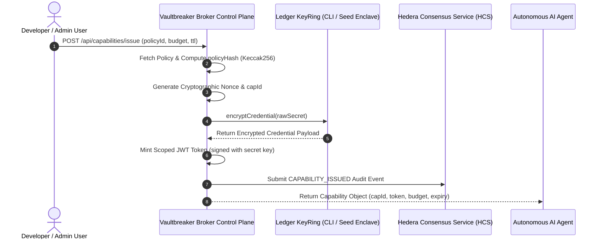
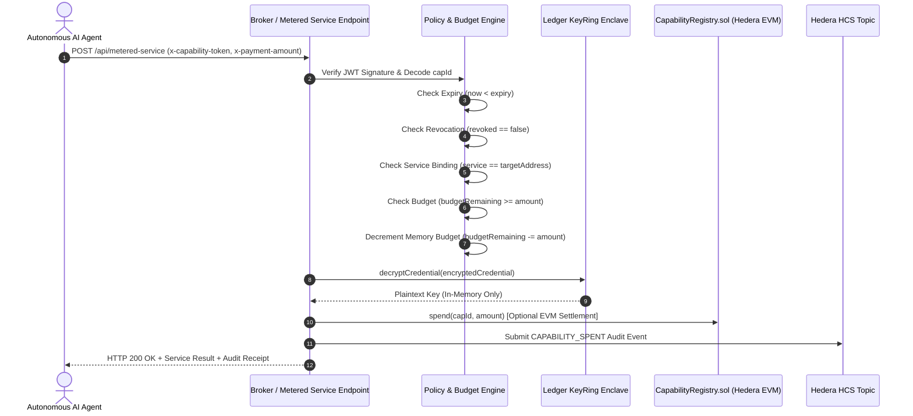
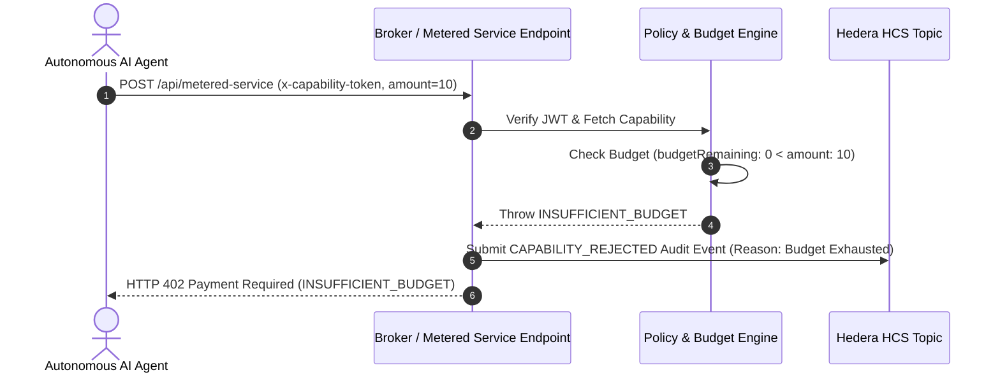
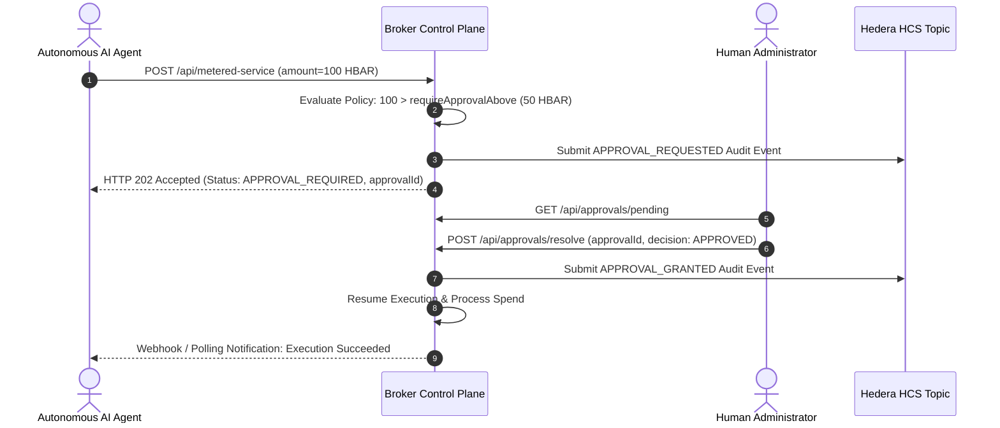

# Vaultbreaker 2.0 Authorization Flow

## 1. Executive Authorization Pipeline Overview

The Vaultbreaker authorization flow defines the decision process when an autonomous AI agent attempts to execute a metered service request. Every request passes through seven evaluation stages:

```
[Agent Request] 
      │
      ▼
1. Authenticate Request & Verify Capability JWT Token
      │
      ▼
2. Resolve Capability & Policy Context
      │
      ▼
3. Validate Service Endpoint Binding (WHERE?)
      │
      ▼
4. Validate Time-to-Live & Expiration (WHEN?)
      │
      ▼
5. Check Revocation & Velocity Rate Limits (CONDITIONS?)
      │
      ▼
6. Evaluate Spend Amount & Remaining Budget (HOW MUCH?)
      │
      ├──> Budget Exhausted / Expired / Revoked  ──> [DENY] (HTTP 402/403 + HCS Audit)
      ├──> Amount > Approval Threshold          ──> [APPROVAL_REQUIRED] (Pause Flow)
      └──> Checks Pass                           ──> [ALLOW]
                                                        │
                                                        ▼
7. Decrypt Credential via Ledger KeyRing -> Execute -> Settle -> Audit (HCS)
```

---

## 2. Sequence Diagram 1: Capability Issuance Flow



---

## 3. Sequence Diagram 2: Metered Request Allowed Flow (`ALLOW`)



---

## 4. Sequence Diagram 3: Over-Budget Rejection Flow (`DENY`)



---

## 5. Sequence Diagram 4: Human Approval Flow (`APPROVAL_REQUIRED`)


