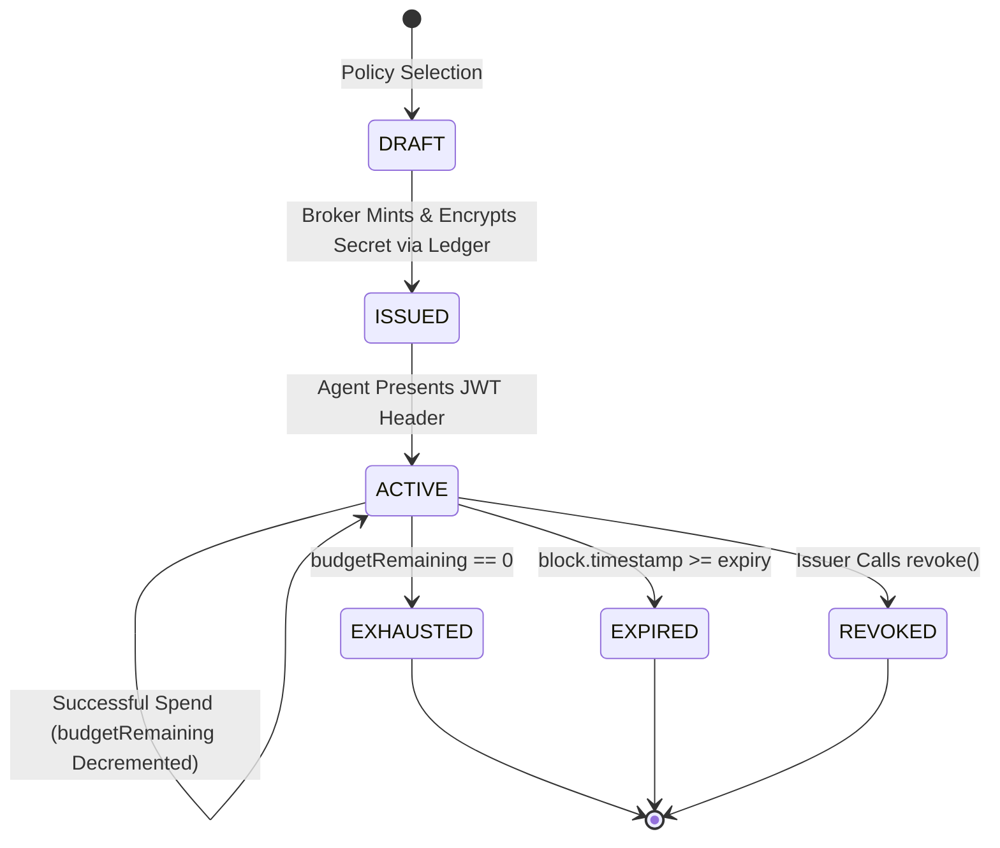

# Vaultbreaker 2.0 Capability Model

## 1. Executive Definition: What is a Capability?

In Vaultbreaker, a **Capability** is a cryptographically signed, short-lived, spend-limited authority object issued to an autonomous AI agent. It grants the agent explicit permission to execute specific actions on specific metered services without giving the agent raw wallet credentials or unconstrained API keys.

A Capability answers six fundamental security questions:

| Dimension | Question | Capability Specification |
|---|---|---|
| **WHO?** | Which agent is authorized? | Bound to `agentId` and `issuerAddress`. |
| **WHAT?** | What action can it perform? | Scoped to specified endpoint methods (e.g. `/api/metered-service`). |
| **WHERE?** | Where can it be used? | Bound to target `serviceAddress` on-chain (e.g. `0x000...004`). |
| **WHEN?** | When is authority valid? | Enforced by strict unix timestamp `expiry` (TTL). |
| **HOW MUCH?** | What is the spend ceiling? | Constrained by hard budget ceiling (`budgetRemaining` / `budgetTotal`). |
| **CONDITIONS?** | Under what state rules? | Must not be `revoked`, must match `policyHash`, must pass rate limits. |

---

## 2. Capability Conceptual Structure

```
Agent
  ↓
Capability Object
  ├── capId: bytes32 (Keccak256 hash of policy + service + budget + expiry + nonce)
  ├── agentId: string (Target AI Agent)
  ├── policyHash: bytes32 (Keccak256 hash of underlying policy rules)
  ├── serviceAddress: address (Target EVM service binding)
  ├── budgetTotal: uint256 (Initial assigned spend limit)
  ├── budgetRemaining: uint256 (Real-time remaining spend limit)
  ├── expiry: uint256 (Unix expiration timestamp)
  ├── encryptedCredential: string (Ledger KeyRing protected key reference)
  ├── token: string (Signed JWT bearer token for HTTP headers)
  └── revoked: boolean (On-chain revocation status)
```

---

## 3. Capability vs Policy: The Critical Distinction

A common confusion in security architecture is blurring **Policy** and **Capability**. Vaultbreaker strictly separates them:

| Attribute | Spend Policy (`Policy`) | Scoped Capability (`Capability`) |
|---|---|---|
| **Nature** | Abstract Rule Template | Instantiated Authority Token |
| **Scope** | Generic across an organization | Specific to ONE Agent for ONE Service |
| **Mutability** | Editable template created by developer | Immutable authority object once issued |
| **Storage** | Off-chain database | Signed JWT (off-chain) + Hash (on-chain) |
| **Accounting** | Defines maximum budget rules | Tracks real-time remaining balance (`budgetRemaining`) |
| **Analogy** | Company Expense Policy Handbook | Pre-funded Corporate Credit Card with $50 Limit |

---

## 4. Capability Lifecycle



### 1. Creation & Policy Selection
A developer selects a registered `SpendPolicy` (e.g., `Max Call: 10 HBAR`, `Daily Budget: 50 HBAR`, `TTL: 3600s`).

### 2. Issuance & Hardware Enclave Binding
The broker computes `policyHash`, generates a cryptographic nonce, encrypts the underlying wallet settlement credential using the Ledger KeyRing (`keyring.encryptCredential`), and signs a JWT bearer token. The event `CAPABILITY_ISSUED` is logged to Hedera HCS.

### 3. Activation & Verification
The agent attaches the capability JWT to HTTP request header `x-capability-token`. The broker/service verifies token signature, checks `serviceAddress` binding, and confirms `block.timestamp < expiry` and `revoked == false`.

### 4. Usage & Budget Accounting
Upon each valid request, `budgetRemaining` is decremented by the request amount. On-chain accounting is updated in `CapabilityRegistry.sol`.

### 5. Expiration
When `block.timestamp >= expiry`, any subsequent call returns HTTP 402 `CAPABILITY_EXPIRED` and is rejected on-chain in real time.

### 6. Revocation
The issuing developer or contract owner can invoke `revoke(capId)` at any time via broker API or direct smart contract call. Once set, `revoked = true` permanently blocks all future requests with HTTP 403 `CAPABILITY_REVOKED`.

### 7. Renewal
Capabilities are immutable. Once expired or exhausted, a capability cannot be edited; the developer/agent must request a **new** capability instance.
