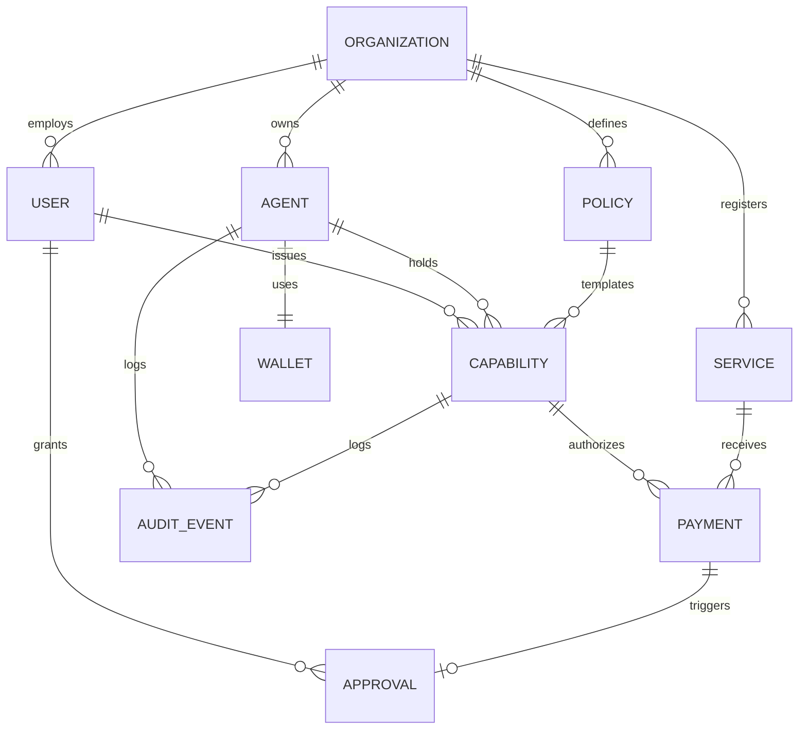

# Vaultbreaker 2.0 Core Domain Model

## 1. Overview

The Vaultbreaker 2.0 domain model provides authorization and financial control infrastructure for autonomous AI agents. This document defines the 12 canonical domain entities, their ownership hierarchies, lifecycles, schemas, relationships, and security considerations based on the Phase 0 baseline architecture and target state.

---

## 2. Canonical Entity Definitions

### 1. Organization (`Organization`)
- **Purpose**: Top-level administrative tenant representing a company, team, or developer collective managing AI agents and metered services.
- **Ownership**: Root entity. Owns Users, Agents, Policies, Services, and Key Rings.
- **Lifecycle**: `ACTIVE` -> `SUSPENDED` -> `DELETED`.
- **Key Fields**: `orgId`, `name`, `billingAccount`, `createdAt`, `status`.
- **Relationships**: 1:N with User, 1:N with Agent, 1:N with Service, 1:N with Policy.
- **Security Considerations**: Multi-tenant isolation boundary; cross-org data leakage must be strictly prevented at the API gateway layer.

### 2. User (`User`)
- **Purpose**: Human administrator, developer, or operator with authority to register policies, mint capabilities, or grant human approvals.
- **Ownership**: Belongs to an `Organization`.
- **Lifecycle**: `INVITED` -> `ACTIVE` -> `DISABLED`.
- **Key Fields**: `userId`, `orgId`, `email`, `role` (`ADMIN` | `DEVELOPER` | `AUDITOR` | `APPROVER`), `pubKey`, `createdAt`.
- **Relationships**: Belongs to `Organization`; creates `Policy`, `Agent`, `Capability`; performs `Approval`.
- **Security Considerations**: Requires MFA and strong Web3/OIDC authentication; human privileges must be explicitly scoped via Role-Based Access Control (RBAC).

### 3. Agent (`Agent`)
- **Purpose**: Autonomous AI actor (LLM loop, background script, or multi-agent node) requesting resources and executing metered actions.
- **Ownership**: Owned by an `Organization` and managed by a `User`.
- **Lifecycle**: `CREATED` -> `ACTIVE` -> `SUSPENDED` -> `COMPROMISED` -> `REVOKED` -> `ARCHIVED`.
- **Key Fields**: `agentId`, `orgId`, `ownerId`, `name`, `status`, `assignedWalletId`, `spentTotal`, `lastActiveAt`, `createdAt`.
- **Relationships**: 1:N with Capability; 1:1 with Wallet (or shared Wallet); 1:N with Payment; 1:N with AuditEvent.
- **Security Considerations**: Autonomous actors MUST NEVER hold raw private keys in memory; authentication relies on cryptographic identity tokens or scoped JWTs.

### 4. Wallet (`Wallet`)
- **Purpose**: On-chain account (EVM / Hedera Account) holding native tokens (HBAR/ETH) or ERC-20 assets for transaction settlement.
- **Ownership**: Owned by `Organization` / `User`; bound to one or more `Agents`.
- **Lifecycle**: `UNINITIALIZED` -> `ACTIVE` -> `LOCKED` -> `DRAINED`.
- **Key Fields**: `walletId`, `address`, `networkId` (e.g. Hedera Testnet 296), `keyringProvider` (`LEDGER_CLI` | `SEED_ENCLAVE`), `balance`, `encryptedPrivateKeyRef`.
- **Relationships**: Bound to `Agent`; referenced during `Payment` settlement.
- **Security Considerations**: Settlement private keys are strictly managed inside the Broker Ledger KeyRing hardware enclave and are NEVER returned to agent memory.

### 5. Capability (`Capability`)
- **Purpose**: Short-lived, spend-limited, scoped authority object granting an Agent specific permission to call a Service within strict limits.
- **Ownership**: Issued by a `User`/Broker on behalf of an `Organization`; assigned to a specific `Agent`.
- **Lifecycle**: `ISSUED` -> `ACTIVE` -> `EXPIRED` -> `REVOKED` -> `EXHAUSTED`.
- **Key Fields**: `capId`, `agentId`, `policyId`, `policyHash`, `serviceAddress`, `budgetTotal`, `budgetRemaining`, `expiry`, `issuer`, `token` (JWT), `revoked`, `createdAt`.
- **Relationships**: Derived from `Policy`; bound to `Agent` and `Service`; referenced by `Payment` and `AuditEvent`.
- **Security Considerations**: Represented on-chain as a cryptographic hash in `CapabilityRegistry.sol`; on-chain spend accounting guarantees hard budget ceilings.

### 6. Policy (`Policy`)
- **Purpose**: Template defining allowable behavior, maximum price per call, daily budgets, time-to-live (TTL), and approval rules for capabilities.
- **Ownership**: Created and owned by `User` / `Organization`.
- **Lifecycle**: `DRAFT` -> `ACTIVE` -> `DEPRECATED` -> `ARCHIVED`.
- **Key Fields**: `policyId`, `orgId`, `name`, `serviceEndpoint`, `serviceAddress`, `maxPricePerCall`, `dailyBudget`, `ttlSeconds`, `requireApprovalAbove`, `createdAt`.
- **Relationships**: Template for `Capability`; 1:N with `Capability`.
- **Security Considerations**: Policies stay off-chain in the broker database; only their cryptographic hash (`policyHash`) is published on-chain.

### 7. Service (`Service`)
- **Purpose**: External or internal pay-per-call API endpoint (e.g. AI Text Summarizer, Compute, Data Feed) protected by Vaultbreaker.
- **Ownership**: Registered by `Organization` or external Service Provider.
- **Lifecycle**: `REGISTERED` -> `ACTIVE` -> `DEPRECATED` -> `OFFLINE`.
- **Key Fields**: `serviceId`, `name`, `serviceEndpoint`, `serviceAddress`, `pricePerCall`, `acceptedAsset`, `status`, `createdAt`.
- **Relationships**: Bound to `Policy` and `Capability`; recipient of `Payment`.
- **Security Considerations**: Service endpoint binding prevents an agent from reusing a capability issued for Service A to pay for Service B (`SERVICE_MISMATCH`).

### 8. Payment (`Payment`)
- **Purpose**: Financial transaction record representing asset transfer from Agent/Wallet to Service Provider.
- **Ownership**: Belongs to `Agent`, `Capability`, and `Service`.
- **Lifecycle**: `INITIATED` -> `AUTHORIZED` -> `PENDING_SETTLEMENT` -> `SETTLED` -> `FAILED` -> `REJECTED`.
- **Key Fields**: `paymentId`, `capId`, `agentId`, `serviceAddress`, `amount`, `asset`, `status`, `txHash`, `settledAt`.
- **Relationships**: Executed under a `Capability`; updates `Wallet` balance and `Capability.budgetRemaining`.
- **Security Considerations**: Payments MUST fail atomically if capability budget is exhausted, expired, or revoked.

### 9. Approval (`Approval`)
- **Purpose**: Human-in-the-loop decision record required when an agent action exceeds policy threshold limits.
- **Ownership**: Created by Policy Engine; resolved by a authorized `User`.
- **Lifecycle**: `PENDING` -> `APPROVED` -> `REJECTED` -> `EXPIRED`.
- **Key Fields**: `approvalId`, `agentId`, `capId`, `requestedAmount`, `requestedAction`, `approverId`, `status`, `expiresAt`, `resolvedAt`.
- **Relationships**: Triggered by `Payment` request exceeding threshold; resolves execution flow.
- **Security Considerations**: Approvals must be time-bounded (short TTL) and one-time use to prevent replay attacks.

### 10. Audit Event (`AuditEvent`)
- **Purpose**: Immutable, tamper-evident record of any lifecycle or security event logged to Hedera Consensus Service (HCS).
- **Ownership**: System-wide event.
- **Lifecycle**: `GENERATED` -> `SUBMITTED_TO_HCS` -> `VERIFIED_ONCHAIN`.
- **Key Fields**: `eventId`, `eventType`, `sequenceNumber`, `topicId`, `agentId`, `capId`, `amount`, `reason`, `timestamp`, `txHash`.
- **Relationships**: References `Agent`, `Capability`, `Service`, `Payment`.
- **Security Considerations**: Written to Hedera HCS topic for public auditability; sensitive payload fields are hashed or anonymized.

### 11. Session (`Session`)
- **Purpose**: Active authentication token for a Human User or Agent interacting with the Vaultbreaker Broker API.
- **Ownership**: Belongs to `User` or `Agent`.
- **Lifecycle**: `ACTIVE` -> `EXPIRED` -> `TERMINATED`.
- **Key Fields**: `sessionId`, `subjectId` (userId or agentId), `role`, `expiresAt`, `createdAt`.
- **Relationships**: Authenticates API calls across all entities.
- **Security Considerations**: Must be signed with strong asymmetric/symmetric keys and checked on every admin route.

### 12. Credential (`Credential`)
- **Purpose**: Protected private key, API secret, or signing key managed within the hardware enclave.
- **Ownership**: Owned by `Organization`; referenced by `Wallet` or `Service`.
- **Lifecycle**: `ENCRYPTED` -> `DECRYPTED_IN_MEMORY` -> `PURGED`.
- **Key Fields**: `credentialId`, `provider` (`LEDGER_CLI` | `SEED_ENCLAVE`), `iv`, `tag`, `ciphertext`.
- **Relationships**: Decrypted temporarily inside broker memory during settlement; bound to `Wallet`.
- **Security Considerations**: Plaintext credentials MUST NEVER be stored on disk, logged, or returned in API responses.

---

## 3. Core Entity Relationship Diagram

